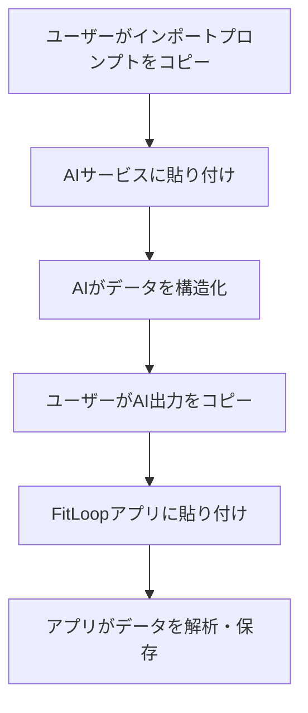

# FitLoop データインポート/エクスポート仕様書

## 1. 概要

フロントエンド専用アプリケーションとして、ユーザーがAIサービス（Claude、ChatGPT、Gemini等）とやり取りする際のデータインポート/エクスポートの仕組みを定義します。

## 2. データインポートフロー

### 2.1 基本的なインポート手順



### 2.2 インポートプロンプトテンプレート

#### 2.2.1 トレーニングデータインポート

```typescript
const TRAINING_IMPORT_PROMPT = `
以下の筋トレ記録をJSON形式に整理してください。

【記録】
{{userInput}}

【出力形式】
必ず以下のJSON形式で出力してください：
\`\`\`json
{
  "type": "training_session",
  "date": "YYYY-MM-DD",
  "exercises": [
    {
      "name": "エクササイズ名",
      "sets": [
        {
          "weight": 数値,
          "weightUnit": "kg" または "lbs",
          "reps": 数値,
          "rpe": 数値（1-10、オプション）
        }
      ]
    }
  ],
  "cardio": {
    "type": "種類（ランニング、サイクリング等）",
    "duration": 分数,
    "distance": 数値,
    "distanceUnit": "km" または "miles"
  },
  "notes": "メモ"
}
\`\`\`
`;
```

#### 2.2.2 身体測定データインポート

```typescript
const MEASUREMENT_IMPORT_PROMPT = `
体組成計のスクリーンショットまたは測定データから、以下の情報を抽出してJSON形式で出力してください。

【入力データ】
{{imageOrText}}

【出力形式】
\`\`\`json
{
  "type": "body_measurement",
  "date": "YYYY-MM-DD",
  "measurements": {
    "weight": { "value": 数値, "unit": "kg" },
    "bodyFatPercentage": 数値,
    "muscleMass": { "value": 数値, "unit": "kg" },
    "bmi": 数値,
    "metabolicAge": 数値,
    "visceralFat": 数値,
    "bodyWater": 数値
  },
  "device": "測定機器名（分かる場合）"
}
\`\`\`
`;
```

#### 2.2.3 過去のトレーニング履歴インポート

```typescript
const HISTORY_IMPORT_PROMPT = `
以下の筋トレ履歴を分析し、構造化されたデータとして出力してください。

【履歴データ】
{{historyText}}

【出力形式】
\`\`\`json
{
  "type": "training_history",
  "sessions": [
    {
      "date": "YYYY-MM-DD",
      "exercises": [
        {
          "name": "エクササイズ名",
          "totalVolume": 総負荷量,
          "maxWeight": 最大重量,
          "avgReps": 平均回数
        }
      ]
    }
  ],
  "summary": {
    "totalSessions": セッション数,
    "dateRange": {
      "start": "YYYY-MM-DD",
      "end": "YYYY-MM-DD"
    },
    "muscleGroups": ["対象筋肉群のリスト"],
    "progressTrends": {
      "strength": "向上/維持/低下",
      "consistency": "高/中/低"
    }
  }
}
\`\`\`
`;
```

### 2.3 インポートデータパーサー

```typescript
class DataImportParser {
  // AI出力からJSONを抽出
  extractJSON(aiOutput: string): any {
    // コードブロック内のJSONを探す
    const jsonMatch = aiOutput.match(/```json\s*([\s\S]*?)```/);
    if (jsonMatch) {
      try {
        return JSON.parse(jsonMatch[1]);
      } catch (e) {
        throw new Error('無効なJSON形式です');
      }
    }
    
    // プレーンJSONを試す
    try {
      return JSON.parse(aiOutput);
    } catch (e) {
      throw new Error('JSONを見つけられませんでした');
    }
  }

  // データ型の検証
  validateImportData(data: any): ImportedData {
    if (!data.type) {
      throw new Error('データタイプが指定されていません');
    }

    switch (data.type) {
      case 'training_session':
        return this.validateTrainingSession(data);
      case 'body_measurement':
        return this.validateMeasurement(data);
      case 'training_history':
        return this.validateHistory(data);
      default:
        throw new Error(`不明なデータタイプ: ${data.type}`);
    }
  }

  // トレーニングセッションの検証
  private validateTrainingSession(data: any): TrainingSessionImport {
    if (!data.date || !data.exercises || !Array.isArray(data.exercises)) {
      throw new Error('必須フィールドが不足しています');
    }

    return {
      type: 'training_session',
      date: new Date(data.date),
      exercises: data.exercises.map(this.validateExercise),
      cardio: data.cardio,
      notes: data.notes || ''
    };
  }

  // エクササイズデータの検証
  private validateExercise(exercise: any) {
    if (!exercise.name || !exercise.sets || !Array.isArray(exercise.sets)) {
      throw new Error('エクササイズデータが不完全です');
    }

    return {
      name: exercise.name,
      sets: exercise.sets.map((set: any) => ({
        weight: Number(set.weight),
        weightUnit: set.weightUnit || 'kg',
        reps: Number(set.reps),
        rpe: set.rpe ? Number(set.rpe) : undefined
      }))
    };
  }
}
```

### 2.4 インポートUI実装

```tsx
import React, { useState } from 'react';
import { Upload, AlertCircle, CheckCircle } from 'lucide-react';

const DataImportWizard: React.FC = () => {
  const [step, setStep] = useState<'prompt' | 'paste' | 'confirm'>('prompt');
  const [importType, setImportType] = useState<'training' | 'measurement' | 'history'>('training');
  const [userInput, setUserInput] = useState('');
  const [aiOutput, setAiOutput] = useState('');
  const [parsedData, setParsedData] = useState<any>(null);
  const [error, setError] = useState<string | null>(null);

  const generatePrompt = () => {
    const prompts = {
      training: TRAINING_IMPORT_PROMPT,
      measurement: MEASUREMENT_IMPORT_PROMPT,
      history: HISTORY_IMPORT_PROMPT
    };

    const prompt = prompts[importType].replace('{{userInput}}', userInput);
    return prompt;
  };

  const handleParse = () => {
    try {
      const parser = new DataImportParser();
      const json = parser.extractJSON(aiOutput);
      const validated = parser.validateImportData(json);
      setParsedData(validated);
      setError(null);
      setStep('confirm');
    } catch (e) {
      setError(e.message);
    }
  };

  const handleImport = async () => {
    if (!parsedData) return;

    try {
      // データを保存
      await saveImportedData(parsedData);
      // 成功通知
      alert('データのインポートが完了しました！');
      // リセット
      setStep('prompt');
      setUserInput('');
      setAiOutput('');
      setParsedData(null);
    } catch (e) {
      setError('インポート中にエラーが発生しました');
    }
  };

  return (
    <div className="max-w-4xl mx-auto p-6">
      <h2 className="text-2xl font-bold mb-6">データインポート</h2>

      {/* ステップインジケーター */}
      <div className="flex justify-between mb-8">
        <div className={`flex-1 text-center ${step === 'prompt' ? 'text-blue-600' : 'text-gray-400'}`}>
          1. プロンプト生成
        </div>
        <div className={`flex-1 text-center ${step === 'paste' ? 'text-blue-600' : 'text-gray-400'}`}>
          2. AI出力を貼り付け
        </div>
        <div className={`flex-1 text-center ${step === 'confirm' ? 'text-blue-600' : 'text-gray-400'}`}>
          3. 確認・インポート
        </div>
      </div>

      {step === 'prompt' && (
        <div>
          <div className="mb-4">
            <label className="block text-sm font-medium mb-2">インポートタイプ</label>
            <select
              value={importType}
              onChange={(e) => setImportType(e.target.value as any)}
              className="w-full p-2 border rounded"
            >
              <option value="training">トレーニングデータ</option>
              <option value="measurement">身体測定データ</option>
              <option value="history">過去の履歴</option>
            </select>
          </div>

          <div className="mb-4">
            <label className="block text-sm font-medium mb-2">
              インポートしたいデータを入力してください
            </label>
            <textarea
              value={userInput}
              onChange={(e) => setUserInput(e.target.value)}
              className="w-full h-32 p-2 border rounded"
              placeholder="例: ベンチプレス 60kg 10回 3セット..."
            />
          </div>

          <div className="bg-blue-50 p-4 rounded mb-4">
            <h3 className="font-semibold mb-2">生成されたプロンプト</h3>
            <pre className="whitespace-pre-wrap text-sm">{generatePrompt()}</pre>
          </div>

          <button
            onClick={() => {
              navigator.clipboard.writeText(generatePrompt());
              setStep('paste');
            }}
            className="w-full bg-blue-500 text-white py-2 rounded hover:bg-blue-600"
          >
            プロンプトをコピーして次へ
          </button>
        </div>
      )}

      {step === 'paste' && (
        <div>
          <div className="mb-4">
            <p className="text-sm text-gray-600 mb-2">
              コピーしたプロンプトをClaude、ChatGPT、またはGeminiに貼り付けて、
              返答をここに貼り付けてください。
            </p>
            <textarea
              value={aiOutput}
              onChange={(e) => setAiOutput(e.target.value)}
              className="w-full h-64 p-2 border rounded"
              placeholder="AIの返答を貼り付けてください..."
            />
          </div>

          {error && (
            <div className="bg-red-50 p-3 rounded mb-4 flex items-center">
              <AlertCircle className="text-red-500 mr-2" size={20} />
              <span className="text-red-700">{error}</span>
            </div>
          )}

          <div className="flex gap-2">
            <button
              onClick={() => setStep('prompt')}
              className="flex-1 bg-gray-300 text-gray-700 py-2 rounded"
            >
              戻る
            </button>
            <button
              onClick={handleParse}
              className="flex-1 bg-blue-500 text-white py-2 rounded hover:bg-blue-600"
            >
              データを解析
            </button>
          </div>
        </div>
      )}

      {step === 'confirm' && parsedData && (
        <div>
          <div className="bg-green-50 p-4 rounded mb-4">
            <h3 className="font-semibold mb-2 flex items-center">
              <CheckCircle className="text-green-500 mr-2" size={20} />
              解析成功！
            </h3>
            <pre className="text-sm overflow-auto">
              {JSON.stringify(parsedData, null, 2)}
            </pre>
          </div>

          <div className="flex gap-2">
            <button
              onClick={() => setStep('paste')}
              className="flex-1 bg-gray-300 text-gray-700 py-2 rounded"
            >
              戻る
            </button>
            <button
              onClick={handleImport}
              className="flex-1 bg-green-500 text-white py-2 rounded hover:bg-green-600"
            >
              インポート実行
            </button>
          </div>
        </div>
      )}
    </div>
  );
};
```

## 3. データエクスポート

### 3.1 エクスポート形式

#### 3.1.1 完全バックアップ（JSON）

```typescript
interface FullBackupExport {
  version: "1.0";
  exportDate: string;
  appVersion: string;
  data: {
    profile: UserProfile;
    context: Context;
    sessions: TrainingSession[];
    measurements: BodyMeasurement[];
    prompts: GeneratedPrompt[];
  };
  metadata: {
    totalSessions: number;
    dateRange: {
      start: string;
      end: string;
    };
  };
}
```

#### 3.1.2 分析用エクスポート（CSV）

```typescript
// トレーニングログCSV
const exportTrainingCSV = (sessions: TrainingSession[]): string => {
  const headers = ['Date', 'Exercise', 'Set', 'Weight', 'Reps', 'Volume'];
  const rows = [];

  sessions.forEach(session => {
    session.exercises.forEach(exercise => {
      exercise.sets.forEach((set, index) => {
        rows.push([
          session.date.toISOString().split('T')[0],
          exercise.name,
          index + 1,
          set.weight,
          set.reps,
          set.weight * set.reps
        ]);
      });
    });
  });

  return [headers, ...rows].map(row => row.join(',')).join('\n');
};
```

#### 3.1.3 共有用サマリー

```typescript
const exportSummary = (data: ExportData): string => {
  return `
# FitLoop トレーニングサマリー

## 期間
${data.dateRange.start} 〜 ${data.dateRange.end}

## 統計
- 総セッション数: ${data.totalSessions}
- 総トレーニング時間: ${data.totalHours}時間
- 平均週間頻度: ${data.avgWeeklyFrequency}回

## 主な成果
${data.achievements.map(a => `- ${a}`).join('\n')}

## 筋力向上
${data.strengthGains.map(g => `- ${g.exercise}: ${g.startWeight}kg → ${g.endWeight}kg (+${g.improvement}%)`).join('\n')}

---
Generated by FitLoop
  `;
};
```

### 3.2 エクスポートUI実装

```tsx
import React, { useState } from 'react';
import { Download, Copy, Check } from 'lucide-react';

const DataExportPanel: React.FC = () => {
  const [exportType, setExportType] = useState<'full' | 'csv' | 'summary'>('full');
  const [dateRange, setDateRange] = useState({ start: '', end: '' });
  const [exported, setExported] = useState(false);

  const handleExport = async () => {
    const data = await prepareExportData(exportType, dateRange);
    
    switch (exportType) {
      case 'full':
        downloadJSON(data, `fitloop-backup-${new Date().toISOString()}.json`);
        break;
      case 'csv':
        downloadCSV(data, `fitloop-training-log.csv`);
        break;
      case 'summary':
        await navigator.clipboard.writeText(data);
        setExported(true);
        setTimeout(() => setExported(false), 2000);
        break;
    }
  };

  return (
    <div className="max-w-2xl mx-auto p-6">
      <h2 className="text-2xl font-bold mb-6">データエクスポート</h2>

      <div className="space-y-4">
        <div>
          <label className="block text-sm font-medium mb-2">エクスポートタイプ</label>
          <select
            value={exportType}
            onChange={(e) => setExportType(e.target.value as any)}
            className="w-full p-2 border rounded"
          >
            <option value="full">完全バックアップ (JSON)</option>
            <option value="csv">トレーニングログ (CSV)</option>
            <option value="summary">共有用サマリー (テキスト)</option>
          </select>
        </div>

        {exportType !== 'full' && (
          <div className="grid grid-cols-2 gap-4">
            <div>
              <label className="block text-sm font-medium mb-2">開始日</label>
              <input
                type="date"
                value={dateRange.start}
                onChange={(e) => setDateRange({ ...dateRange, start: e.target.value })}
                className="w-full p-2 border rounded"
              />
            </div>
            <div>
              <label className="block text-sm font-medium mb-2">終了日</label>
              <input
                type="date"
                value={dateRange.end}
                onChange={(e) => setDateRange({ ...dateRange, end: e.target.value })}
                className="w-full p-2 border rounded"
              />
            </div>
          </div>
        )}

        <div className="bg-gray-50 p-4 rounded">
          <h3 className="font-semibold mb-2">エクスポート内容</h3>
          <p className="text-sm text-gray-600">
            {exportType === 'full' && 'すべてのデータを含む完全なバックアップファイル'}
            {exportType === 'csv' && 'Excelなどで開けるトレーニングログ'}
            {exportType === 'summary' && 'SNSやメッセージで共有できるテキストサマリー'}
          </p>
        </div>

        <button
          onClick={handleExport}
          className="w-full bg-blue-500 text-white py-2 rounded hover:bg-blue-600 flex items-center justify-center"
        >
          {exportType === 'summary' ? (
            <>
              {exported ? <Check size={20} className="mr-2" /> : <Copy size={20} className="mr-2" />}
              {exported ? 'コピー済み' : 'クリップボードにコピー'}
            </>
          ) : (
            <>
              <Download size={20} className="mr-2" />
              ダウンロード
            </>
          )}
        </button>
      </div>
    </div>
  );
};
```

## 4. データ同期プロンプト

### 4.1 デバイス間同期

```typescript
const SYNC_EXPORT_PROMPT = `
# FitLoop データ同期用コード

以下のコードを他のデバイスのFitLoopアプリで入力してください：

\`\`\`
${generateSyncCode(exportData)}
\`\`\`

有効期限: ${new Date(Date.now() + 24 * 60 * 60 * 1000).toLocaleString()}
`;

const SYNC_IMPORT_PROMPT = `
同期コードを貼り付けてください。
AIを使用せずに、直接アプリ内で処理されます。
`;
```

## 5. セキュリティ考慮事項

### 5.1 個人情報の取り扱い

```typescript
class PrivacyManager {
  // エクスポート時の個人情報削除
  sanitizeForPublicSharing(data: any): any {
    const sanitized = { ...data };
    
    // 名前を匿名化
    if (sanitized.profile?.name) {
      sanitized.profile.name = 'User';
    }
    
    // 具体的な日付を相対日付に
    if (sanitized.sessions) {
      const baseDate = new Date(sanitized.sessions[0]?.date);
      sanitized.sessions = sanitized.sessions.map((session, index) => ({
        ...session,
        date: `Day ${index + 1}`
      }));
    }
    
    return sanitized;
  }

  // インポート時の検証
  validateImportedData(data: any): ValidationResult {
    const issues = [];
    
    // サイズチェック
    const jsonSize = JSON.stringify(data).length;
    if (jsonSize > 10 * 1024 * 1024) { // 10MB
      issues.push('データサイズが大きすぎます');
    }
    
    // 悪意のあるコードチェック
    if (JSON.stringify(data).includes('<script>')) {
      issues.push('不正なコードが含まれている可能性があります');
    }
    
    return {
      valid: issues.length === 0,
      issues
    };
  }
}
```

## 6. エラーハンドリング

```typescript
const importErrorMessages = {
  INVALID_JSON: 'JSONフォーマットが正しくありません。AIの出力を確認してください。',
  MISSING_FIELDS: '必要なデータが不足しています。',
  INVALID_DATE: '日付の形式が正しくありません。',
  DUPLICATE_DATA: '既に同じデータが存在します。',
  STORAGE_FULL: 'ストレージ容量が不足しています。'
};

const handleImportError = (error: ImportError) => {
  const message = importErrorMessages[error.code] || 'インポート中にエラーが発生しました';
  
  // ユーザーフレンドリーなエラー表示
  showNotification({
    type: 'error',
    title: 'インポートエラー',
    message,
    action: error.recoverable ? {
      label: '再試行',
      onClick: () => retryImport()
    } : undefined
  });
};
```