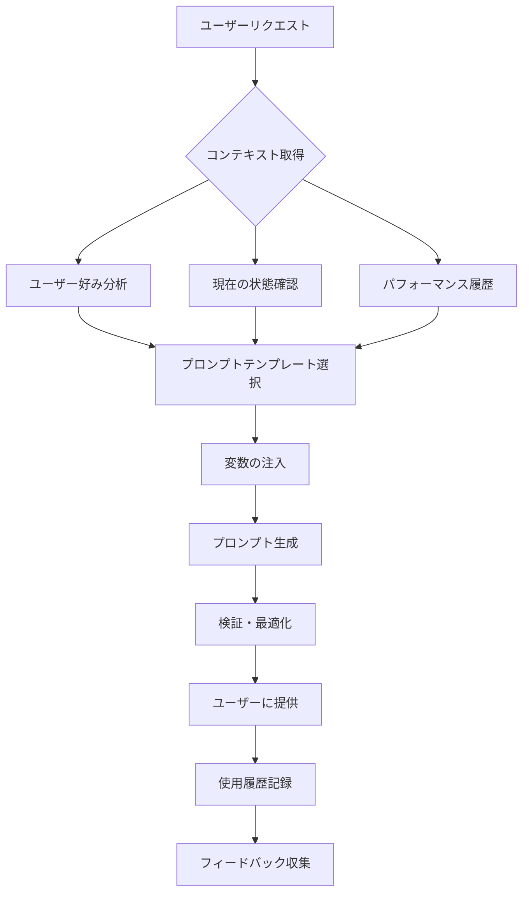

# FitLoop プロンプト提供システム設計書

## 1. システム概要

プロンプト提供システムは、ユーザーの状態とコンテキストに基づいて、最適なプロンプトを生成・提供します。AIが提案するのではなく、ユーザーが必要とするものを提供するという原則に従います。

## 2. プロンプト生成フロー



## 3. プロンプトタイプ

### 3.1 トレーニングプロンプト

```typescript
interface TrainingPrompt {
  type: 'training';
  purpose: 'session' | 'cycle_review' | 'goal_setting';
  
  // コンテキスト情報
  context: {
    currentSession: number;
    cycleNumber: number;
    lastPerformance: ExercisePerformance[];
    userGoals: string;
    environment: string;
  };
  
  // 生成されるプロンプト構造
  structure: {
    introduction: string;      // 現在の状況説明
    objectives: string[];      // 今回の目標
    exercises: string;         // エクササイズ詳細
    dataTracking: string;      // 記録方法の説明
    nextSteps: string;        // 次回への指示
  };
}
```

### 3.2 データインポートプロンプト

```typescript
interface ImportPrompt {
  type: 'import';
  source: 'screenshot' | 'training_log' | 'body_composition';
  
  // インポート指示
  instructions: {
    preparation: string;       // 準備手順
    aiPrompt: string;         // AIに送るプロンプト
    dataFormat: string;       // 期待されるデータ形式
    validation: string;       // 検証方法
  };
  
  // サンプル
  example: {
    input: string;
    expectedOutput: string;
  };
}
```

### 3.3 分析プロンプト

```typescript
interface AnalysisPrompt {
  type: 'analysis';
  focus: 'muscle_balance' | 'progress' | 'optimization';
  
  // 分析用データ
  data: {
    timeRange: DateRange;
    metrics: string[];
    comparisons: string[];
  };
  
  // 出力形式
  outputFormat: {
    summary: boolean;
    details: boolean;
    recommendations: boolean;
    visualizations: string[];
  };
}
```

## 4. プロンプトテンプレート管理

### 4.1 テンプレート構造

```typescript
const trainingPromptTemplate = `
# {{userName}}さんの筋トレシステム - セッション{{sessionNumber}}

## 現在の状況
- サイクル: {{cycleNumber}}/8
- 前回のトレーニング: {{lastTrainingDate}}
- 現在の目標: {{primaryGoal}}

## 今日のトレーニング: {{sessionType}}

### エクササイズ
{{#exercises}}
{{order}}. **{{name}}**
   - セット数: {{sets}}
   - 推奨重量: {{weight}}{{unit}}
   - 目標回数: {{reps}}
   - 休憩時間: {{rest}}秒
{{/exercises}}

### パフォーマンス記録方法
以下の形式で記録してください：
\`\`\`
{{exerciseRecordingFormat}}
\`\`\`

## 前回からの改善ポイント
{{improvements}}

## 注意事項
{{safetyNotes}}

---
このプロンプトをAI（Claude/ChatGPT/Gemini）にコピーして、トレーニング指導を受けてください。
`;
```

### 4.2 変数管理システム

```typescript
interface TemplateVariables {
  // ユーザー情報
  user: {
    name: string;
    preferences: UserPreferences;
  };
  
  // セッション情報
  session: {
    number: number;
    type: string;
    date: Date;
  };
  
  // パフォーマンスデータ
  performance: {
    lastSession: ExercisePerformance[];
    trends: PerformanceTrends;
    recommendations: string[];
  };
  
  // 環境情報
  environment: {
    equipment: string[];
    constraints: string[];
    time: number;
  };
}

// 変数注入関数
function injectVariables(template: string, variables: TemplateVariables): string {
  return Mustache.render(template, flattenVariables(variables));
}
```

## 5. プロンプト最適化戦略

### 5.1 コンテキスト最適化

```typescript
class PromptOptimizer {
  // プロンプトの長さを最適化
  optimizeLength(prompt: string, maxTokens: number): string {
    if (estimateTokens(prompt) <= maxTokens) return prompt;
    
    // 優先度に基づいて情報を削減
    const sections = this.parseSections(prompt);
    return this.prioritizeAndTrim(sections, maxTokens);
  }
  
  // ユーザーの使用AIに合わせて最適化
  optimizeForAI(prompt: string, targetAI: 'claude' | 'chatgpt' | 'gemini'): string {
    const optimizations = {
      claude: this.optimizeForClaude,
      chatgpt: this.optimizeForChatGPT,
      gemini: this.optimizeForGemini,
    };
    
    return optimizations[targetAI](prompt);
  }
  
  // パフォーマンスデータに基づいて調整
  adjustBasedOnPerformance(prompt: string, performance: PerformanceData): string {
    const adjustments = this.analyzePerformance(performance);
    return this.applyAdjustments(prompt, adjustments);
  }
}
```

### 5.2 フィードバックループ

```typescript
interface PromptFeedback {
  promptId: string;
  userId: string;
  
  // 有用性評価
  usefulness: {
    rating: 1 | 2 | 3 | 4 | 5;
    helpful: boolean;
    accurate: boolean;
  };
  
  // 具体的なフィードバック
  feedback: {
    tooLong?: boolean;
    tooShort?: boolean;
    missingInfo?: string[];
    unnecessaryInfo?: string[];
    suggestions?: string;
  };
  
  // AI応答の品質
  aiResponse: {
    quality: 'excellent' | 'good' | 'fair' | 'poor';
    followed: boolean;
    errors?: string[];
  };
}

// フィードバックに基づく改善
async function improveTemplate(templateId: string, feedbacks: PromptFeedback[]) {
  const analysis = analyzeFeedbacks(feedbacks);
  
  if (analysis.averageRating < 3.5) {
    const improvements = generateImprovements(analysis);
    await updateTemplate(templateId, improvements);
  }
}
```

## 6. API実装

### 6.1 プロンプト生成エンドポイント

```typescript
// POST /api/v1/prompt/generate
export async function generatePrompt(request: Request): Promise<Response> {
  const { userId, type, purpose } = await request.json();
  
  // コンテキスト取得
  const context = await getUserContext(userId);
  const preferences = await getUserPreferences(userId);
  
  // テンプレート選択
  const template = await selectTemplate(type, purpose, context);
  
  // 変数準備
  const variables = prepareVariables(context, preferences);
  
  // プロンプト生成
  const prompt = injectVariables(template.content, variables);
  
  // 最適化
  const optimized = optimizePrompt(prompt, context.targetAI);
  
  // 保存と返却
  const saved = await saveGeneratedPrompt(userId, optimized, context);
  
  return new Response(JSON.stringify({
    success: true,
    data: {
      promptId: saved.id,
      content: optimized,
      expiresAt: saved.expiresAt,
      metadata: {
        type,
        purpose,
        sessionNumber: context.currentState.sessionNumber,
      },
    },
  }));
}
```

### 6.2 プロンプト履歴エンドポイント

```typescript
// GET /api/v1/prompt/history
export async function getPromptHistory(request: Request): Promise<Response> {
  const { userId } = authenticate(request);
  const { limit = 10, offset = 0 } = getQueryParams(request);
  
  const history = await fetchPromptHistory(userId, { limit, offset });
  
  return new Response(JSON.stringify({
    success: true,
    data: {
      prompts: history.map(formatPromptForResponse),
      total: history.total,
      hasMore: history.hasMore,
    },
  }));
}
```

## 7. プロンプトライブラリ

### 7.1 基本プロンプトセット

```typescript
const promptLibrary = {
  // 初回セットアップ
  initialSetup: {
    welcome: loadTemplate('prompts/initial/welcome.md'),
    goalSetting: loadTemplate('prompts/initial/goal-setting.md'),
    environmentAssessment: loadTemplate('prompts/initial/environment.md'),
  },
  
  // トレーニングセッション
  training: {
    strength: loadTemplate('prompts/training/strength.md'),
    circuit: loadTemplate('prompts/training/circuit.md'),
    recovery: loadTemplate('prompts/training/recovery.md'),
  },
  
  // データインポート
  import: {
    screenshot: loadTemplate('prompts/import/screenshot.md'),
    manualEntry: loadTemplate('prompts/import/manual.md'),
    bulk: loadTemplate('prompts/import/bulk.md'),
  },
  
  // 分析・レビュー
  analysis: {
    weekly: loadTemplate('prompts/analysis/weekly.md'),
    cycleEnd: loadTemplate('prompts/analysis/cycle-end.md'),
    progress: loadTemplate('prompts/analysis/progress.md'),
  },
};
```

### 7.2 カスタムプロンプト作成

```typescript
interface CustomPromptBuilder {
  // ユーザーが独自のプロンプトを作成
  createCustom(userId: string, config: CustomPromptConfig): Promise<PromptTemplate>;
  
  // 既存プロンプトをフォーク
  forkTemplate(templateId: string, modifications: Modifications): Promise<PromptTemplate>;
  
  // コミュニティでシェア
  shareTemplate(templateId: string, visibility: 'private' | 'public'): Promise<void>;
}
```

## 8. セキュリティとプライバシー

### 8.1 プロンプト内の個人情報管理

```typescript
class PromptSanitizer {
  // 個人情報のマスキング
  maskPersonalInfo(prompt: string): string {
    return prompt
      .replace(/\b\d{3,}\b/g, 'XXX')  // 数値のマスキング
      .replace(EMAIL_REGEX, 'user@example.com')
      .replace(PHONE_REGEX, 'XXX-XXXX-XXXX');
  }
  
  // 共有時の情報削除
  prepareForSharing(prompt: string): string {
    return this.removeUserSpecificData(
      this.maskPersonalInfo(prompt)
    );
  }
}
```

### 8.2 アクセス制御

```typescript
// プロンプトへのアクセス権限チェック
async function checkPromptAccess(userId: string, promptId: string): Promise<boolean> {
  const prompt = await getPrompt(promptId);
  
  // 所有者チェック
  if (prompt.userId === userId) return true;
  
  // 共有設定チェック
  if (prompt.shared && prompt.visibility === 'public') return true;
  
  // 明示的な共有チェック
  return await isSharedWith(promptId, userId);
}
```

## 9. パフォーマンス最適化

### 9.1 キャッシング戦略

```typescript
const promptCache = {
  // 頻繁に使用されるプロンプトをキャッシュ
  frequent: new LRUCache<string, GeneratedPrompt>({
    max: 100,
    ttl: 1000 * 60 * 60, // 1時間
  }),
  
  // ユーザー別の最新プロンプト
  userRecent: new Map<string, GeneratedPrompt[]>(),
  
  // テンプレートのキャッシュ
  templates: new Map<string, PromptTemplate>(),
};
```

### 9.2 事前生成

```typescript
// 次回セッション用プロンプトの事前生成
async function pregenerateNextPrompt(userId: string) {
  const context = await getUserContext(userId);
  const nextSession = predictNextSession(context);
  
  if (nextSession.probability > 0.8) {
    const prompt = await generatePrompt({
      userId,
      type: nextSession.type,
      purpose: nextSession.purpose,
    });
    
    await cachePrompt(userId, 'next-session', prompt);
  }
}
```