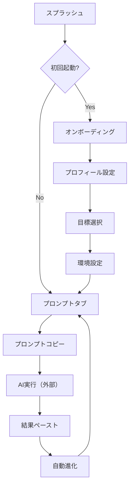

# FitLoop UI/UX デザインドキュメント

## 目次
1. [デザイン理念](#デザイン理念)
2. [ユーザー体験の全体像](#ユーザー体験の全体像)
3. [画面遷移とユーザーフロー](#画面遷移とユーザーフロー)
4. [インターフェース設計](#インターフェース設計)
5. [インタラクションパターン](#インタラクションパターン)
6. [ビジュアルデザイン](#ビジュアルデザイン)
7. [アクセシビリティ](#アクセシビリティ)
8. [パフォーマンス最適化](#パフォーマンス最適化)

## デザイン理念

### コアコンセプト：「ゼロフリクション」
FitLoopは、複雑なフィットネストラッキングを極限までシンプルにすることを目指しています。

**3つの設計原則：**
1. **最小タップ数** - すべての主要機能は3タップ以内でアクセス可能
2. **視覚的明瞭性** - 情報の優先度を明確にし、認知負荷を最小化
3. **継続的な価値** - 使うたびに賢くなるAI連携で長期的なエンゲージメント

## ユーザー体験の全体像

### ユーザージャーニーマップ

```
初回起動 → オンボーディング → プロンプト生成 → AI連携 → トレーニング実行 → 結果記録 → 進化
    ↓           ↓                    ↓              ↓            ↓              ↓           ↓
  期待感    パーソナライズ      驚きと信頼      外部連携     達成感      可視化された成長  継続意欲
```

### ペルソナ別体験設計

#### 1. フィットネス初心者「健太」（28歳・会社員）
- **課題**: 何から始めればいいか分からない
- **体験**: 
  - シンプルな質問で目標設定
  - AIが専門知識を補完
  - 小さな成功体験の積み重ね

#### 2. 中級トレーニー「美咲」（32歳・フリーランス）
- **課題**: プラトー（停滞期）の打破
- **体験**:
  - データドリブンな改善提案
  - 既存アプリとの連携
  - 筋肉バランス分析

#### 3. 上級者「大輔」（35歳・エンジニア）
- **課題**: 効率的なプログラム管理
- **体験**:
  - 高度なカスタマイズ
  - 詳細なデータ分析
  - AIとの対話的な最適化

## 画面遷移とユーザーフロー

### メインフロー


### タブナビゲーション構造
```
┌─────────┬──────────┬───────────┬─────────┐
│プロンプト│プロフィール│ライブラリ │ 使い方  │
└─────────┴──────────┴───────────┴─────────┘
     ↓          ↓           ↓          ↓
  メイン機能  個人設定    履歴管理   ガイド
```

## インターフェース設計

### 1. プロンプトタブ（メイン画面）

#### レイアウト構造
```
┌────────────────────────────┐
│      セッション情報         │ <- 現在の進捗を常に表示
├────────────────────────────┤
│                            │
│    生成されたプロンプト     │ <- 大きなテキストエリア
│                            │
├────────────────────────────┤
│     [コピー] [保存]        │ <- 主要アクション
├────────────────────────────┤
│      AI応答エリア          │ <- 折りたたみ可能
│     [ペースト] [分析]      │
└────────────────────────────┘
```

#### デザイン意図
- **視覚的階層**: セッション情報 > プロンプト > アクション
- **タッチターゲット**: 最小44x44pxを確保
- **スクロール最適化**: 主要コンテンツは画面内に収まる

### 2. プロフィールタブ

#### 情報アーキテクチャ
```
基本情報
├── 名前・年齢・性別
├── 身体測定値
└── 経験レベル

目標設定
├── 主要目標（選択式）
├── カスタム目標
└── 期限設定

環境設定
├── トレーニング場所
├── 利用可能器具
└── 時間的制約

[AIデータインポート] <- 革新的機能
```

#### プログレッシブディスクロージャー
- 初期表示は基本情報のみ
- 「詳細設定」で追加オプション表示
- 認知負荷を段階的に管理

### 3. ライブラリタブ

#### コンテンツ組織化
```
検索バー [          ] 🔍

フィルター: [全て] [最近] [お気に入り]

┌─────────────────────┐
│ セッション8        │
│ 2024-06-04 • 3回使用│
│ [⭐] [📋] [🗑]      │
└─────────────────────┘
```

#### ソート・フィルター戦略
- デフォルト: 最新順
- フィルター: 使用頻度、お気に入り、日付
- 検索: プロンプト内容の全文検索

### 4. 使い方（設定）タブ

#### 構成要素
1. **アプリ設定**
   - ダークモード切替
   - 言語設定
   - AIデータインポート

2. **使い方ガイド**
   - ステップバイステップ説明
   - ビジュアルガイド
   - FAQ

3. **機能紹介**
   - 特徴的な機能の説明
   - ベストプラクティス

## インタラクションパターン

### 1. コピー&ペースト中心の設計

#### フローの最適化
```
タップ → 触覚フィードバック → 視覚的確認 → 完了通知
  ↓           ↓                    ↓            ↓
[コピー]  バイブレーション    ボタン色変化   トースト表示
```

#### フィードバックシステム
- **即時**: ボタンの視覚的変化（100ms以内）
- **確認**: トースト通知（2秒表示）
- **永続**: 履歴への自動保存

### 2. プログレッシブエンハンスメント

#### 段階的な機能開放
```
初級者モード → 標準モード → エキスパートモード
    ↓             ↓              ↓
基本機能のみ   詳細オプション  完全カスタマイズ
```

### 3. エラー処理とリカバリー

#### エラー状態の設計
- **予防**: 入力検証でエラーを未然に防ぐ
- **案内**: 具体的な解決方法を提示
- **回復**: ワンタップでリトライ可能

## ビジュアルデザイン

### カラーシステム

#### ライトモード
```
Primary:   #3B82F6 (Blue-500)    - 主要アクション
Secondary: #8B5CF6 (Purple-500)  - アクセント
Success:   #10B981 (Green-500)   - 完了・成功
Warning:   #F59E0B (Amber-500)   - 注意
Error:     #EF4444 (Red-500)     - エラー
```

#### ダークモード
```
Background: #111827 (Gray-900)
Surface:    #1F2937 (Gray-800)
Text:       #F9FAFB (Gray-50)
```

### タイポグラフィ

```
見出し1: 24px/32px Bold
見出し2: 20px/28px Semibold
本文:    16px/24px Regular
キャプション: 14px/20px Regular
```

### アニメーション原則

1. **目的のある動き**: すべてのアニメーションは情報を伝える
2. **高速**: 最大300ms以内で完了
3. **自然なイージング**: ease-out を基本とする

#### 主要なアニメーション
```css
/* ページ遷移 */
transition: transform 0.3s ease-out;

/* ボタンインタラクション */
transition: all 0.15s ease-out;

/* モーダル表示 */
animation: slideUp 0.3s ease-out;
```

## アクセシビリティ

### WCAG 2.1 AA準拠

#### カラーコントラスト
- 通常テキスト: 4.5:1以上
- 大きいテキスト: 3:1以上
- インタラクティブ要素: 3:1以上

#### キーボードナビゲーション
```
Tab順序:
1. ヘッダー
2. メインコンテンツ
3. プライマリアクション
4. セカンダリアクション
5. タブナビゲーション
```

#### スクリーンリーダー対応
- セマンティックHTML使用
- ARIAラベル適切配置
- フォーカス管理

### 多様なユーザーへの配慮

1. **視覚**: 高コントラストモード対応
2. **運動**: 大きなタッチターゲット（最小44px）
3. **認知**: シンプルな言語、明確な指示

## パフォーマンス最適化

### 初期読み込み最適化

```
目標: First Contentful Paint < 1.8s
     Time to Interactive < 3.8s
```

#### 戦略
1. **コード分割**: ルートベースの遅延読み込み
2. **画像最適化**: WebP形式、遅延読み込み
3. **キャッシュ戦略**: Service Worker活用

### ランタイムパフォーマンス

#### レンダリング最適化
- React.memoによる不要な再レンダリング防止
- useMemoで計算結果キャッシュ
- 仮想スクロールで大量データ処理

#### 状態管理
```typescript
// 最適化された状態更新
const updateProfile = useCallback((updates) => {
  setProfile(prev => ({ ...prev, ...updates }))
}, [])
```

### オフライン対応

#### Progressive Web App機能
1. **Service Worker**: オフラインでも基本機能使用可能
2. **IndexedDB**: ローカルデータ永続化
3. **同期**: オンライン復帰時の自動同期

## メトリクスと改善

### 主要KPI
1. **エンゲージメント**
   - DAU/MAU比率: 目標40%以上
   - セッション時間: 平均5分以上
   - 継続率: 7日後50%、30日後30%

2. **ユーザビリティ**
   - タスク完了率: 90%以上
   - エラー率: 1%未満
   - 顧客満足度: 4.5/5.0以上

### A/Bテスト計画
1. オンボーディングフロー簡略化
2. プロンプト表示方法の最適化
3. 通知タイミングの調整

## 今後の展開

### フェーズ1（現在）
- コア機能の安定化
- ユーザーフィードバック収集
- パフォーマンス最適化

### フェーズ2（3ヶ月後）
- AI直接統合
- ソーシャル機能追加
- 高度な分析機能

### フェーズ3（6ヶ月後）
- ウェアラブル連携強化
- コミュニティ機能
- パーソナルコーチングAI

---

**作成日**: 2025年6月4日  
**バージョン**: 1.0.0  
**作成者**: FitLoop UXチーム